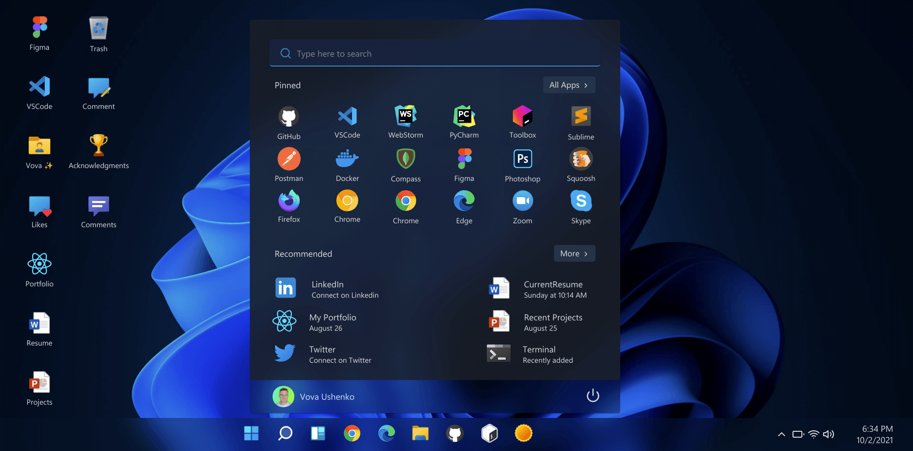
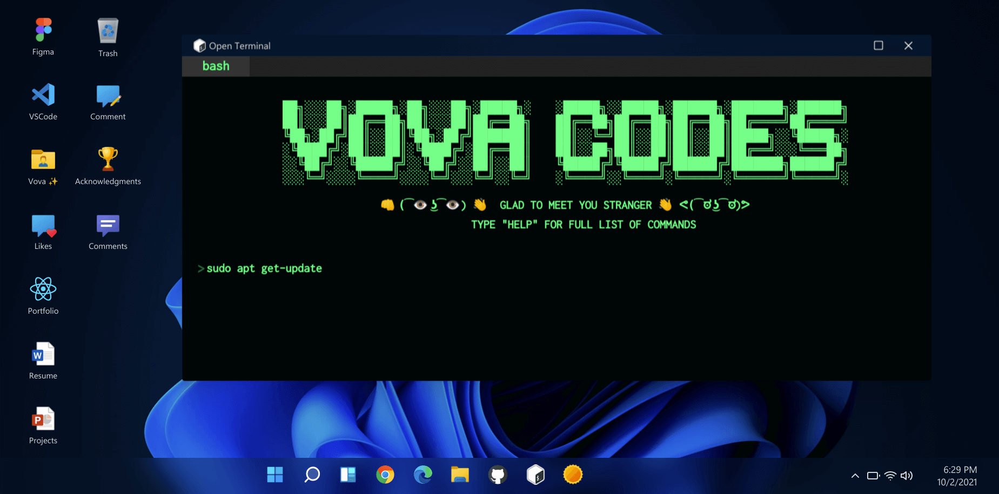
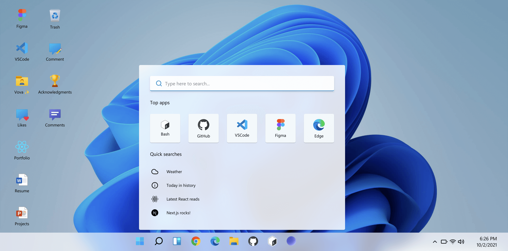
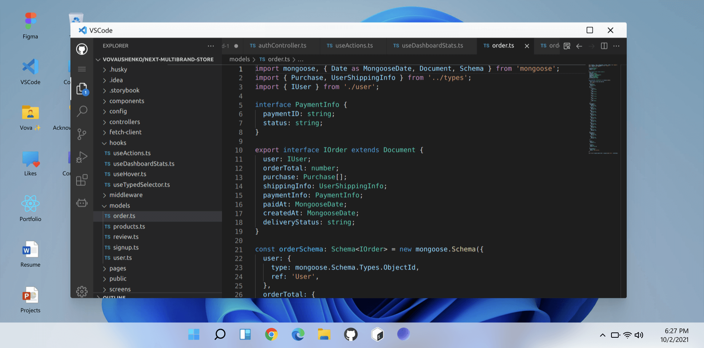

# ✨ Tahir Attar | Portfolio ✨

#### 🔥 Try it online: [https://tahirattar.com/](https://tahir-attar.com/)

#### 🔥 If you really liked the project, consider giving it a star ⭐

#### Feel Free to connect and say hi on any platforms!

# Stack

- Next.js 🚀
- React ⚛
- Redux 🔥
- Styled-components 💅
- MongoDB 🍃

# At glance

## License

⚖️ MIT Copyright (c) 2026 Tahir Attar
