# ✨ Tahir Attar | Portfolio ✨

#### 🔥 Try it online: [https://tahirattar.com/](https://tahir-attar.dev/)

#### 🔥 If you really liked the project, consider giving it a star ⭐

[](https://github.com/tahir-attar)

#### Feel Free to connect and say hi on any linkedin!

[](https://www.linkedin.com/in/tahir-attar/)

## Tech Stack

- Next.js
- React
- Redux
- Styled-components
- Firebase
- MongoDB
- Terminal-in-react

## Overview

This is a Windows 11-inspired portfolio that blends a desktop-style UI with a fully managed content system. It includes a public portfolio experience, a comment system, and an admin panel for managing the content shown across the site.

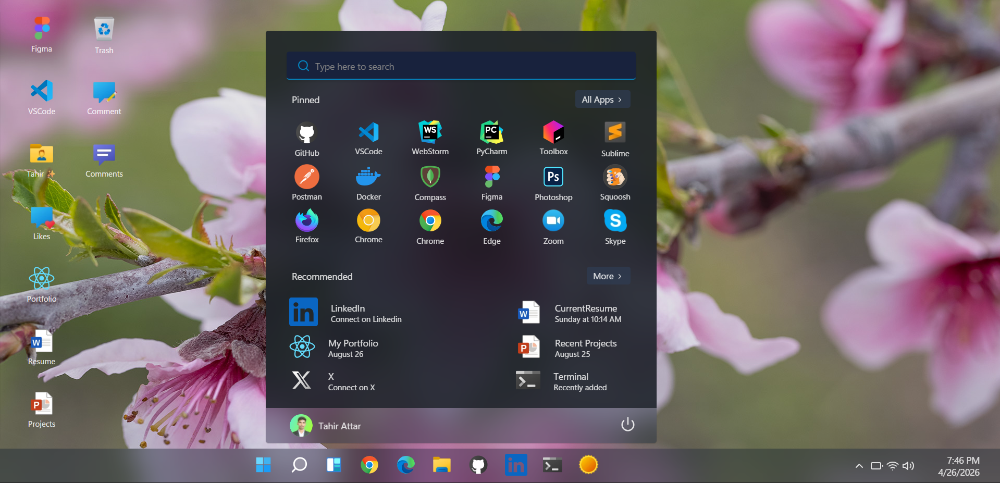

# At glance

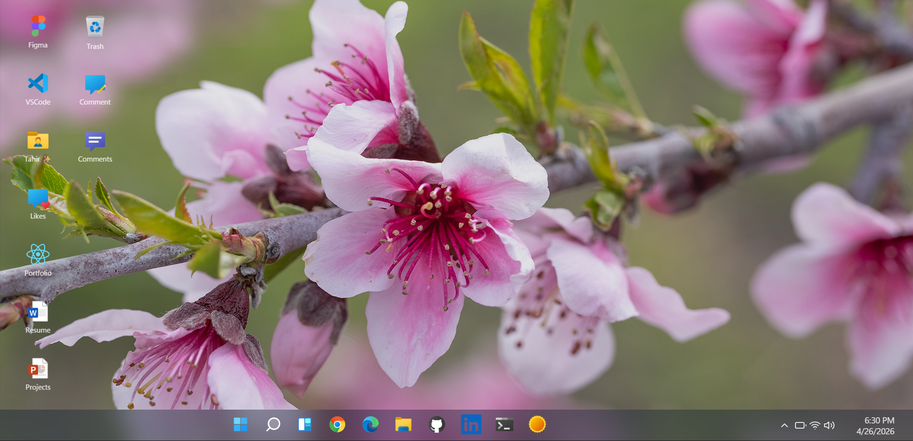
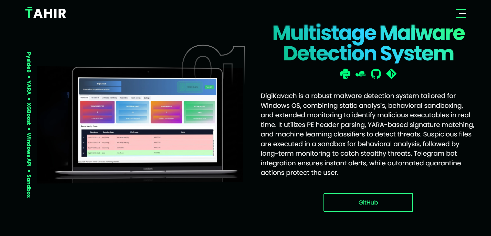
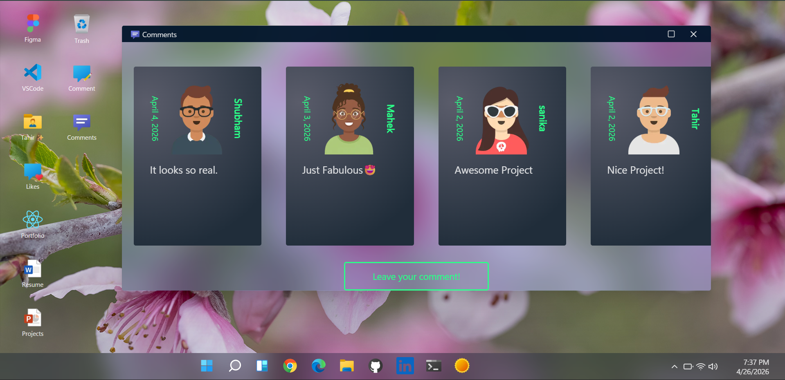
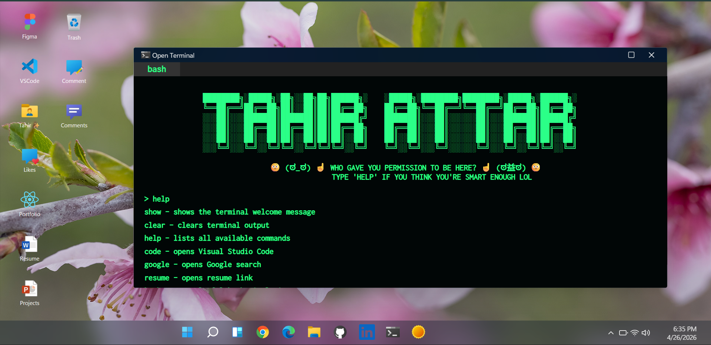

## Features

### Windows 11 Inspired Experience

- Desktop-style home interface with taskbar, windows, and app launch behavior
- Dynamic desktop wallpaper powered by Bing wallpaper
- Smooth intro loader and desktop entrance animations
- Context menus, opened windows manager, and responsive desktop layout behavior
- Mobile-friendly fallback experience for smaller screens

### Portfolio Pages

- Dedicated sections for About, Resume, Projects, Articles, and Contact
- Reusable portfolio layout and typography system
- Project, resume, skills, about, and articles content can be updated from the admin panel

### Comments and Avatars

- Comment system with random avatar assignment based on gender
- Comment cards are rendered in the public portfolio experience

### Admin Panel

- Firebase email/password authentication for admin access
- Firebase Admin for protected server-side operations
- Admin pages for Projects, Articles, Resume, About, and Comments
- Mobile-compatible admin navigation layout

### Widgets and Desktop Apps

- Clock, weather, news, todo, and technology widgets
- Built-in terminal app with custom commands
- Simulated desktop apps and browser-like views
- Configurable UI interactions and modal panels

### UI and Design System

- Styled-components design system with shared variables and reusable styles
- Themed components and utility hooks
- Rich iconography across portfolio and admin experiences

### Performance and UX

- Static generation with incremental revalidation for key pages
- Animation and loading flow improvements for smoother first paint
- Better perceived responsiveness on desktop and mobile

## What You Can Manage From Admin

- Projects section
- Resume section
- About page skills section
- Articles section
- Comments section

## Run Locally

### 1. Install dependencies

```bash
npm install
```

### 2. Create a `.env.local` file

Add the Firebase values used by the app:

```bash
NEXT_PUBLIC_FIREBASE_API_KEY=your_api_key
NEXT_PUBLIC_FIREBASE_AUTH_DOMAIN=your_project.firebaseapp.com
NEXT_PUBLIC_FIREBASE_PROJECT_ID=your_project_id
NEXT_PUBLIC_FIREBASE_STORAGE_BUCKET=your_project.appspot.com
NEXT_PUBLIC_FIREBASE_MESSAGING_SENDER_ID=your_sender_id
NEXT_PUBLIC_FIREBASE_APP_ID=your_app_id
FIREBASE_SERVICE_ACCOUNT_JSON={"type":"service_account",...}
```

### 3. Run the development server

```bash
npm run dev
```

The app starts on port `5000`.

### 4. Build for production

```bash
npm run build
npm start
```

## Firebase Setup

1. Create a Firebase project.
2. Enable Email/Password authentication.
3. Copy the client config values into `.env.local` using the `NEXT_PUBLIC_FIREBASE_*` variables.
4. Generate a service account JSON file from Firebase Admin SDK settings and place its contents into `FIREBASE_SERVICE_ACCOUNT_JSON`.
5. Make sure `NEXT_PUBLIC_FIREBASE_STORAGE_BUCKET` matches your Firebase storage bucket.

The client SDK is initialized in [utils/firebaseClient.ts](utils/firebaseClient.ts), and the admin SDK is initialized in [utils/firebaseAdmin.ts](utils/firebaseAdmin.ts).

## Screenshot Placeholders

Add your final screenshots in a folder such as public/screenshots and replace the placeholders below.

### Home and Desktop

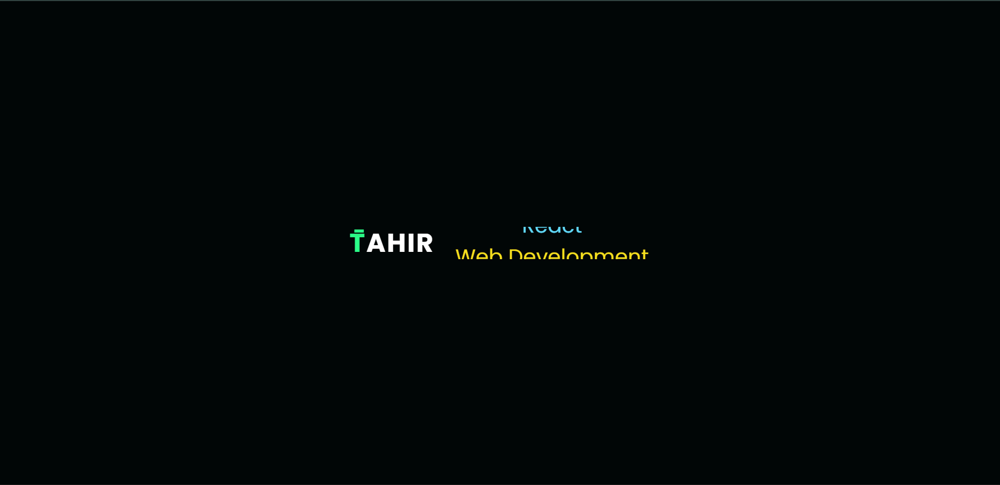

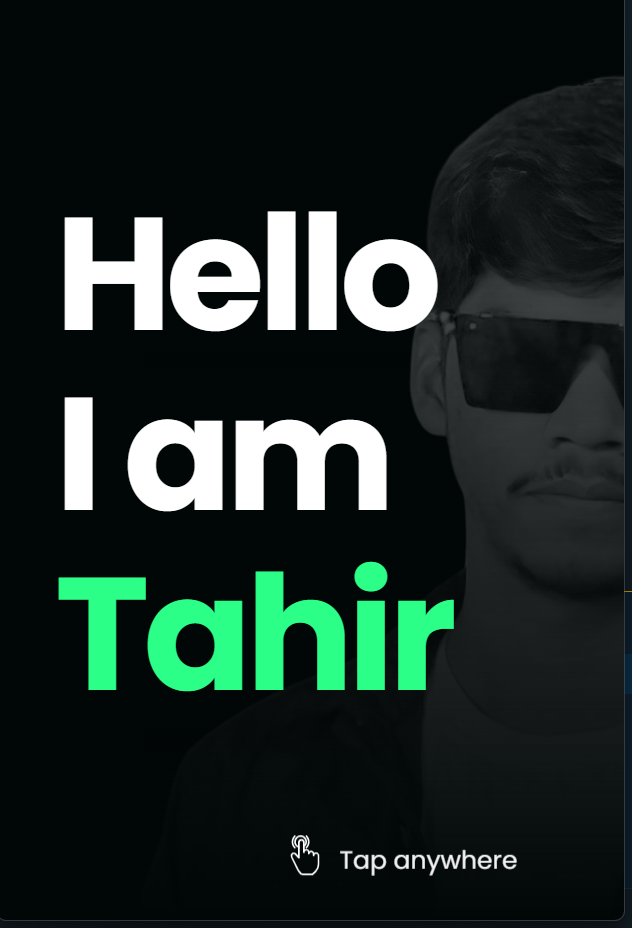

### Portfolio Sections

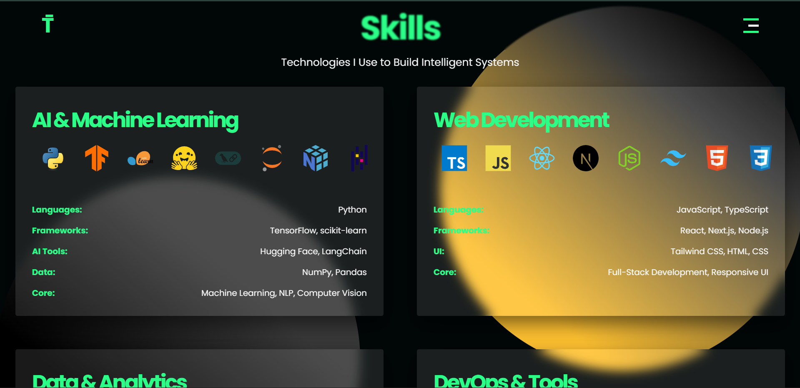

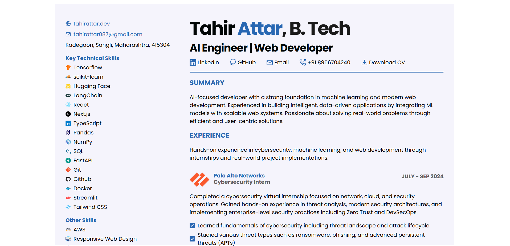
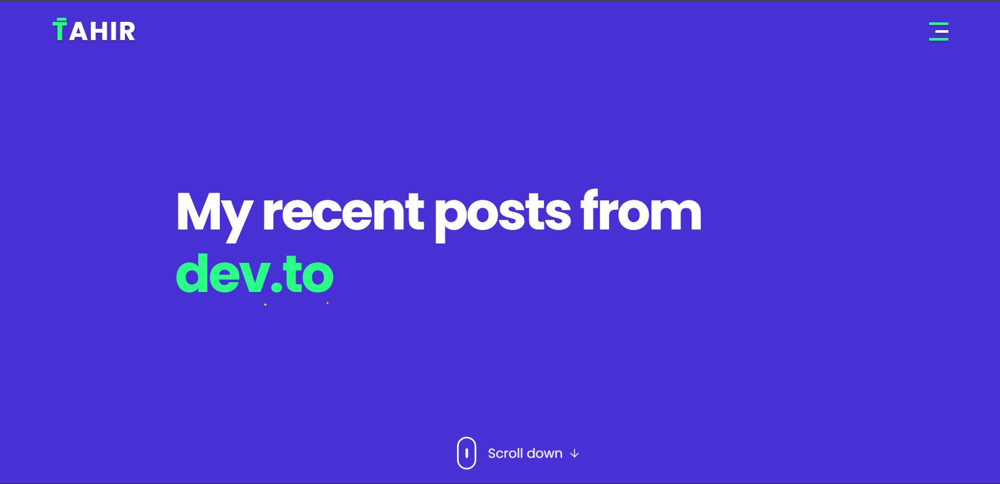
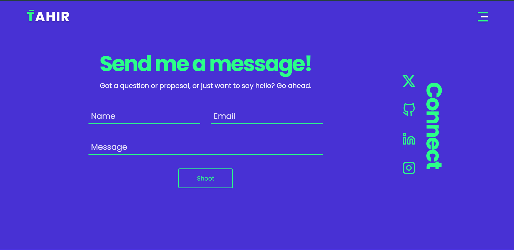

### Widgets and Apps

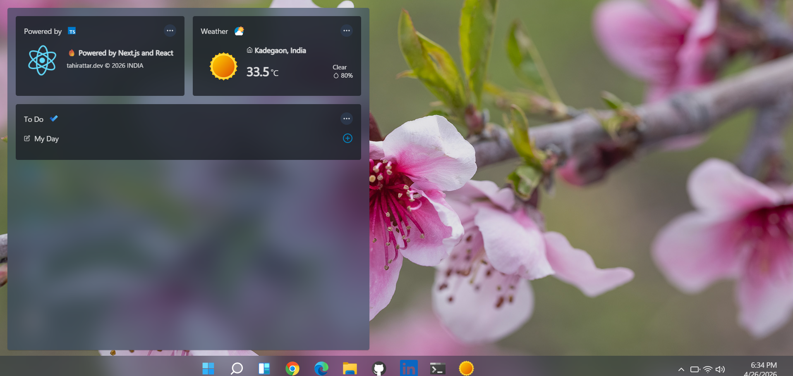

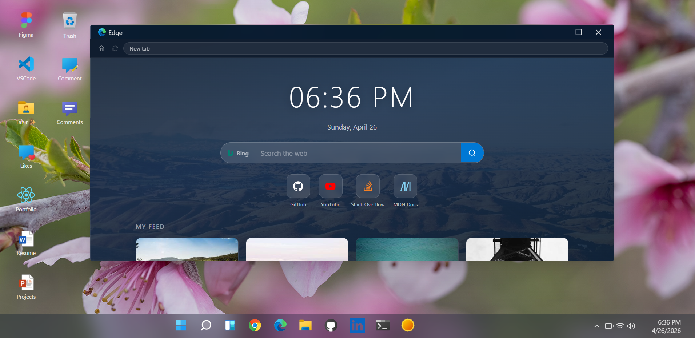

### Admin Panel

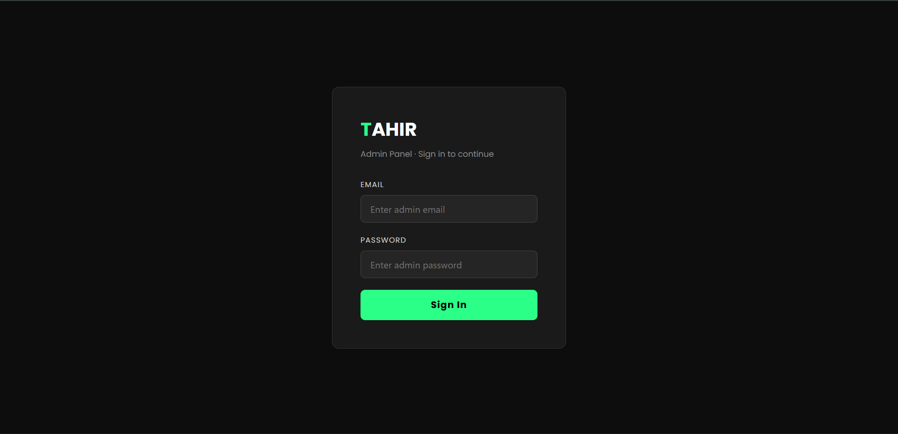
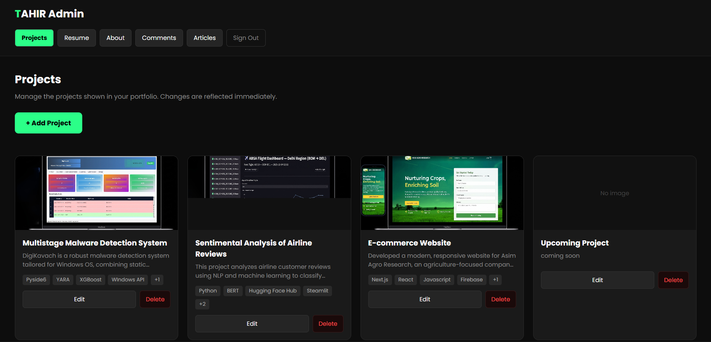
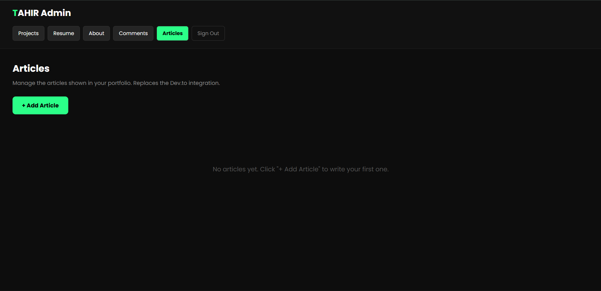
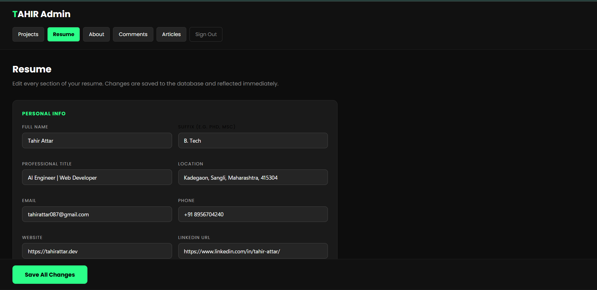
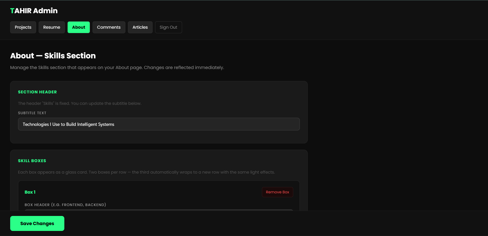
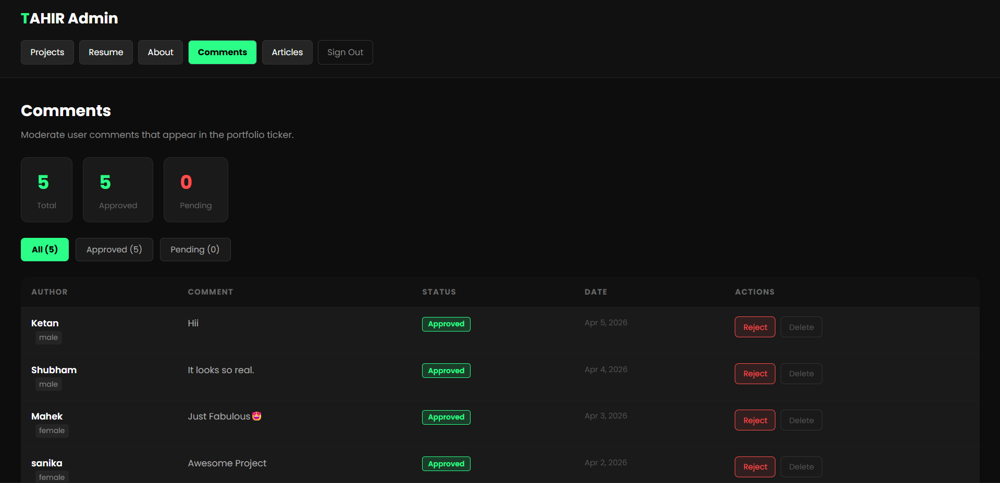

## License

⚖️ MIT Copyright (c) 2026 Tahir Attar
